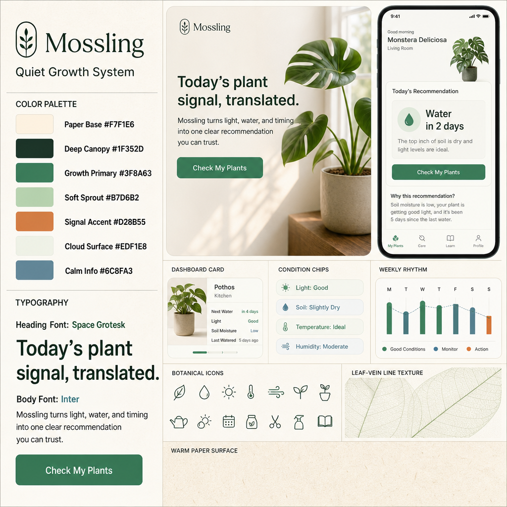
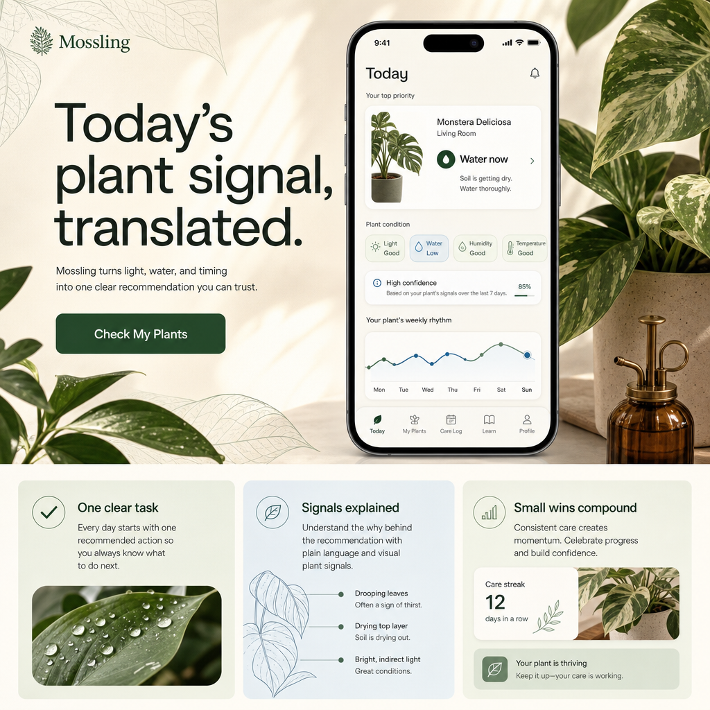
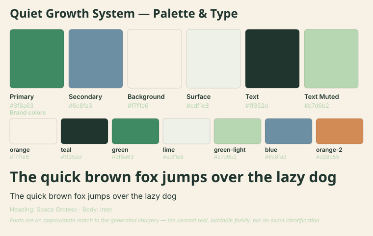
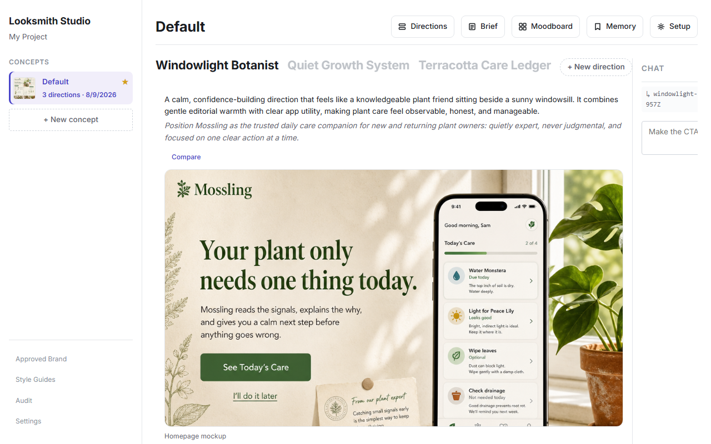

# Keyart

A local creative director for AI-built prototypes — turn a rough brief into visual directions, an exact `brand.css`, style guides, and coding-agent rules.

Your AI-built prototype looks like every other AI-built prototype. Keyart gives it a specific visual identity — and hands your coding agent the rules to keep it.

- **Tokens come from the picture, not a guess.** The exact colors and fonts are read back off the actual generated image, so your CSS and coding-agent rules can never drift from what's on the page.
- **Feedback compounds.** What you approve, discard, or lock is remembered per exploration and shapes every future regeneration.
- **Built for agents too.** A CLI, an MCP server for Cursor/Claude Code, and a deterministic no-key dry-run mode mean humans, agents, and CI can all drive the same loop.

## Install

```bash
npm install -D @wildorder/keyart
```

Requires **Node.js 22.18+** (matches `engines` in `package.json`). You'll want an `OPENAI_API_KEY` for the parts that matter — generating visual directions and extracting real tokens from them. Without one, every command still runs in a deterministic **dry-run** mode (useful for CI, agents, and kicking the tires — see [With and without a key](#with-and-without-a-key) for what that honestly gets you). `keyart audit` and `keyart surface scan` additionally need Playwright — both the npm package and a browser binary: `npm i -D playwright && npx playwright install chromium`.

For local development on Keyart itself:

```bash
git clone https://github.com/wildorder/keyart.git && cd keyart
npm install
npm link
```

## Quickstart

Three nouns cover the whole workflow. A **direction** is one self-contained brand exploration — its **brief** describes what you're building, and each direction grows a history of **versions** as you iterate (a direction with a brief but no versions yet is a *draft*). `approve` picks one direction and codifies it into the CSS, guides, and agent rules your project consumes. The **studio** (`keyart serve`) is a local web app for browsing and editing all of it.

```bash
npx keyart init                    # scaffold config + brand/ folder
npx keyart explore --describe "a calm habit tracker for developers" --count 3
                                      # mint 3 distinct-brief directions + generate v1 each — prints their ids
npx keyart approve <directionId>   # pick one of the printed ids — sets the approved brand + writes guides/CSS/rules
npx keyart serve                   # browse everything in the local studio (http://localhost:4317)
npx keyart audit <url>             # check a live page against your approved style
```

Prefer to shape the brief first? `direction new "warm editorial"` mints a **draft**, `direction brief set <id> oneLiner "…"` / `colorIntent "…"` fill in the structured brief, and `explore <id>` generates its v1. The brief is a **structured record** inside `direction.yaml`, not a markdown file you hand-write — `brand/directions/<id>/brief.md` is a generated projection of it (editing that file has no effect and is overwritten on the next brief write). Author it with `direction brief set`/`patch` (keyless), with `direction brief map "<freeform ramble>"` (keyed — proposes a structured patch you apply), or in the studio's brief form. `direction fork <id>` branches an exploration (brief copied, history fresh); see [`docs/cli-reference.md`](docs/cli-reference.md) for every field and verb.

Every command above also runs with no `OPENAI_API_KEY` set — but be clear-eyed about what that's for. Keyless dry-run exists so CI and coding agents can exercise the full file workflow deterministically, and so you can learn the mechanics before spending money; keyless `explore` writes **placeholder** directions with no images. The reason Keyart exists — generated imagery, and tokens read back off it — needs a key. See [With and without a key](#with-and-without-a-key) for the honest breakdown. For the full command set — feedback, iterating a direction, extracted assets, the surface manifest (a declared inventory of the visual assets your app needs — logos, icons, hero images — and how each maps to the approved brand), and more — see [`docs/cli-reference.md`](docs/cli-reference.md).

## Day 2: the feedback loop

The first `approve` is a starting point, not the end state. What you tell Keyart is remembered per direction and shapes every future generation:

```bash
npx keyart direction feedback <directionId> --body "less neon, calmer surfaces" # record a reaction (yours or a teammate's)
npx keyart regenerate <directionId>    # new version of that direction, shaped by the accumulated feedback
npx keyart approve <directionId>       # re-approve — every guide, CSS var, and agent rule re-codifies
npx keyart audit <url>                 # vision-check the built page against the approved style
```

Locked colors survive regeneration verbatim, discarded crops become negative guidance, and audit findings can be fed back in as more feedback — see [`docs/cli-reference.md`](docs/cli-reference.md) for the full loop (`direction feedback`, `regenerate`, memory lifecycle, fork).

## Example output

Real output from one recorded end-to-end run against a fictional example brand, "Mossling" — see [`docs/examples/starter-brand/`](docs/examples/starter-brand/) for the full set, including `brand.css`, Cursor rules, the style guides, and the verbatim run transcript.

**Generated** — the image model's own output, rendered freely from the brief:





**Deterministic** — code-rendered from the exact tokens read back off the style tile above; no model call, byte-identical on every run:



The local studio, browsing the approved direction:



## What it costs

Keyart itself is free (Apache-2.0) and runs entirely on your machine: no account, no telemetry, no phone-home — the open-source tool never will. Its only network calls go to **your own** OpenAI account with **your own** `OPENAI_API_KEY`, and image generation spends real money. Which commands call which models:

| Command | Text | Vision | Image | Keyless? |
|---|:---:|:---:|:---:|---|
| `explore` | ✓ | ✓ | ✓ | Yes — dry-run writes placeholder directions instead |
| `regenerate` | – | ✓ | ✓ | Yes — dry-run appends a placeholder version instead |
| `asset extract` / `asset regenerate` | – | – | ✓ | Yes — dry-run records the prompt with no PNG |
| `surface fill` | – | – | ✓ | Yes — dry-run records an honest pending fill, no PNG |
| `surface scan` (vision refinement tier only) | – | ✓ | – | Yes — the scan itself is always keyless; refinement is skipped with no key |
| `audit` | – | ✓ | – | Yes — dry-run writes a placeholder critique |
| `explore --describe`/`--from` (divergent brief proposal) | ✓ | – | – | Yes — a deterministic distinct-brief floor takes over with no key |
| `direction brief map`, `direction reconcile` (semantic check) | ✓ | – | – | Yes — both degrade to an empty/floor-only result with no key |
| everything else (`approve`, `asset pack`, `surface bind/show/set/patch/request/retire`, `init`, `doctor`, the `direction` read/write verbs incl. `new`/`fork`/`create`, `rule`, `promote`, the studio's palette reroll) | – | – | – | **Always** — these never call a model, key or no key |

**Image generation spends real money, and `explore --count N` is more than N image generations.** Each direction gets its own style tile *and* homepage mockup — that's **2×N image-model calls** for `explore --count N` (e.g. `--count 3` is 6 image generations), plus one text/vision call to draft the N directions' content and one further vision call per direction to read the design tokens back off its generated tile. `regenerate` makes 3 image-model calls per run (style tile, homepage mockup, and the evocative style board), plus one vision call to re-read the tokens.

### With and without a key

The keyless path is not a lesser version of the product — it's a **different audience**. It exists so CI pipelines and coding agents can drive the full file workflow deterministically (no secrets, no cost, no flakes), and so you can kick the tires before spending money. For a human chasing the actual value — a generated visual identity with exact extracted tokens — the key is not optional. What each mode really gives you:

| Capability | No key | With `OPENAI_API_KEY` |
|---|---|---|
| Scaffold, briefs, directions (new/fork/create), memory, global rules, `doctor` | Everything | Everything |
| `explore` / `regenerate` | Deterministic **placeholder** directions — no images, placeholder tokens. For CI/agents and dry runs, not real branding | Real style tiles, mockups, and boards; tokens **extracted from the generated tile** |
| `direction create` (hand-authored direction) | Full — your content; tokens engine-seeded deterministically from the brief's color intent | Same, and a keyed `regenerate` upgrades the tokens to extraction-backed |
| `approve` → `brand.css`, guides, Cursor rules, asset pack | Full — a deterministic projection of whatever tokens exist; never calls a model | Identical (still no model call) |
| Studio (`keyart serve`) | Full browsing + authoring; the chat rail shows an unavailable state | Everything, plus the chat rail |
| `audit <url>` | Real Playwright screenshot, **placeholder** critique | Screenshot + a vision critique against your approved style |
| `surface scan` | The full deterministic floor scan (DOM walk, candidate crops, anonymous ids) | Floor scan + vision refinement (meaningful ids and descriptions) |
| `asset extract` / `surface fill` | The prompt is recorded honestly; no image is generated | Generated PNGs |

Nothing crashes keyless and nothing is fabricated — placeholder output is always labeled as such. See [Dry-Run Mode](docs/cli-reference.md#dry-run-mode) for the exact per-command behavior.

### Upgrading from the concept era

Keyart's data model collapsed from a two-level `Concept → Direction` hierarchy to
directions as the root (the `remove-concept` program, 2026-08). This is a **clean break
with no migrator**: a `brand/concepts/` tree written by an older build is simply **not
read** — nothing crashes, it just isn't your brand state anymore. To move a project
forward, re-run `npx keyart init` and re-explore (re-recording any brief text or
memory you want to keep); the old tree can be deleted whenever you're done referencing it.

**Default models:** text/vision `gpt-5.5`, image `gpt-image-2` — overridable in `keyart.config.ts`, and `models.baseURL` points Keyart at any OpenAI-compatible endpoint (Azure OpenAI, OpenRouter, a local server; see [Models](docs/cli-reference.md#models)). If your account can't see the default ids, set `models` to ones it can. Both ids were exercised end-to-end against the live OpenAI API on **2026-08-10** to produce the example above; see [`RUN.md`](docs/examples/starter-brand/RUN.md) for the transcript.

## Where to go next

- [`docs/cli-reference.md`](docs/cli-reference.md) — every command, flag, and output path
- [`docs/mcp.md`](docs/mcp.md) — the MCP server for coding agents (Cursor, Claude Code): three domain facades — `keyart_brand`, `keyart_implement`, `keyart_setup` — plus `keyart_help`, each taking forgiving object input like `{ "command": "explore" }`, e.g. `keyart_setup { "command": "doctor" }` to check project readiness
- [`docs/examples/starter-brand/`](docs/examples/starter-brand/) — the full example run: `brand.css`, Cursor rules, guides, and the verbatim transcript
- [Repository](https://github.com/wildorder/keyart) · [Issues](https://github.com/wildorder/keyart/issues)

## License

The code is [Apache-2.0](LICENSE) — use it, fork it, ship it. The **Keyart name** is not part of that license (Apache-2.0 §6 grants no trademark rights): don't use it, or confusingly similar names, for forks or derivative hosted services.
